

  

<h1 align="center">osTicket: Prerequisites and Installation</h1>

  This project demonstrates the installation and initial configuration of osTicket, an open-source help desk ticketing system, within a Windows 10 virtual machine hosted in Microsoft Azure. The lab focused on preparing the required web server environment, installing dependencies, configuring the application, and verifying that the platform was operational.

<h2>🎯 Goals &amp; Objectives</h2>

  The goal of this project was to build a working osTicket environment and understand the dependencies required to host a web-based ticketing system on Windows using IIS.

By the end of this lab, I aimed to:

<ul>
  <li>Deploy a Windows 10 virtual machine in Azure</li>
  <li>Install and configure IIS with CGI support</li>
  <li>Install required components such as PHP, MySQL, and IIS modules</li>
  <li>Deploy osTicket into the IIS web root</li>
  <li>Enable the required PHP extensions for osTicket</li>
  <li>Configure the application and connect it to a MySQL database</li>
  <li>Verify successful installation from both the staff and end-user interfaces</li>
  <li>Perform basic post-installation cleanup and hardening</li>
</ul>

<h2>📌 Overview</h2>

  In this project, I created a Windows 10 Azure virtual machine and used it as the host for an osTicket installation. I enabled IIS, installed the required PHP and MySQL components, configured the web application files, and completed the browser-based setup process.

  This project reinforced how web applications depend on multiple layers working together, including the operating system, web server, runtime environment, database engine, application files, permissions, and final validation through both administrative and customer-facing interfaces.

<h2>🧰 Technologies Used</h2>

<ul>
  <li>Microsoft Azure (Virtual Machines)</li>
  <li>Windows 10</li>
  <li>Remote Desktop Protocol (RDP)</li>
  <li>Internet Information Services (IIS)</li>
  <li>PHP Manager for IIS</li>
  <li>PHP 7.3.8</li>
  <li>MySQL 5.5.62</li>
  <li>HeidiSQL</li>
  <li>osTicket v1.15.8</li>
</ul>

<h2>💻 Environment</h2>

<ul>
  <li>Azure Virtual Machine: <code>osticket-vm</code></li>
  <li>Operating System: Windows 10</li>
  <li>VM Size: 4 vCPUs</li>
  <li>Web Server: IIS with CGI enabled</li>
  <li>Database Server: MySQL 5.5.62</li>
  <li>Application: osTicket v1.15.8</li>
</ul>

<h2>⚙️ Implementation</h2>

<h3>1. Azure Virtual Machine Setup</h3>

<ul>
  <li>Created a Windows 10 virtual machine in Microsoft Azure</li>
  <li>Configured the machine for Remote Desktop access</li>
  <li>Logged into the VM and prepared it for software installation</li>
</ul>

  This provided the base environment for hosting the osTicket application and its required services.

  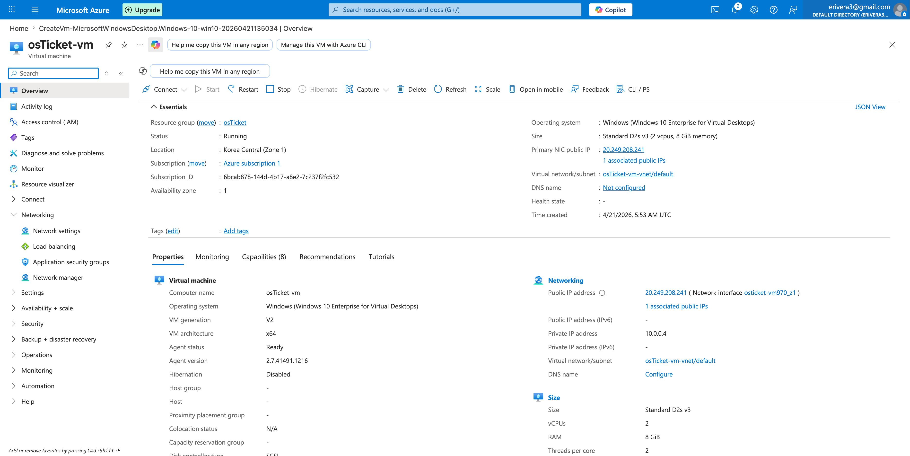

<h3>2. Downloading Installation Files</h3>

<ul>
  <li>Downloaded the <code>osTicket-Installation-Files.zip</code> package inside the virtual machine</li>
  <li>Extracted the files to the desktop</li>
</ul>

  This folder contained the dependencies and installation files required for the lab.

  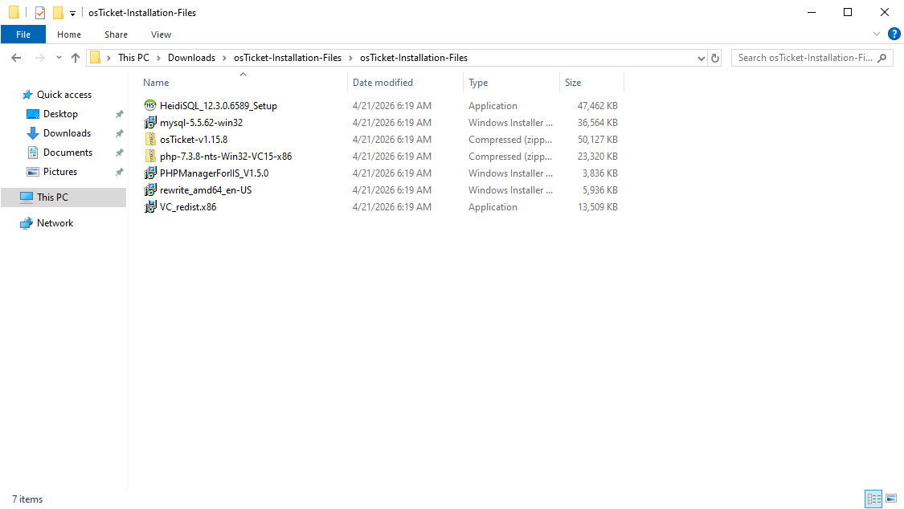

<h3>3. Installing IIS and Required Components</h3>

<ul>
  <li>Enabled IIS in Windows</li>
  <li>Enabled CGI under Application Development Features</li>
  <li>Installed PHP Manager for IIS</li>
  <li>Installed the IIS Rewrite Module</li>
  <li>Created the <code>C:\PHP</code> directory</li>
  <li>Extracted PHP 7.3.8 into <code>C:\PHP</code></li>
  <li>Installed the Visual C++ Redistributable</li>
</ul>

  These steps established the web server environment and prepared IIS to support PHP-based applications.

  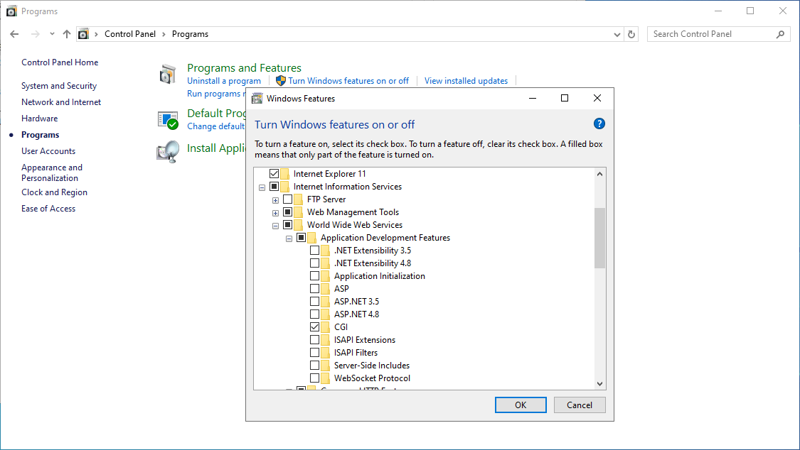

  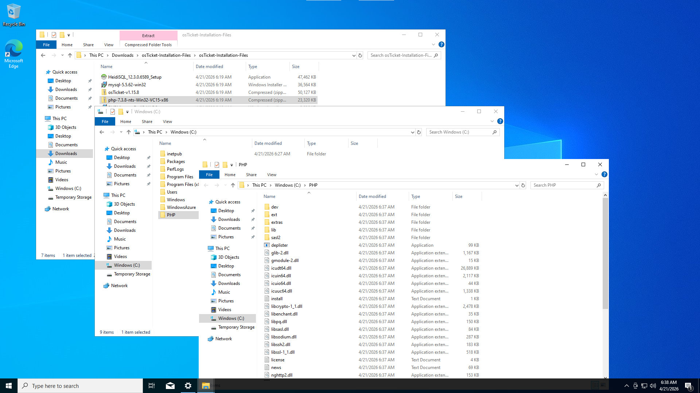

<h3>4. Registering PHP in IIS</h3>

<ul>
  <li>Opened IIS as an administrator</li>
  <li>Reviewed PHP Manager before registration</li>
  <li>Registered PHP by pointing IIS to <code>C:\PHP\php-cgi.exe</code></li>
  <li>Restarted IIS to apply the configuration</li>
</ul>

  This connected the PHP runtime to IIS so PHP files could be executed properly through the web server.

<table align="center">
  <tr>
    <td align="center">
      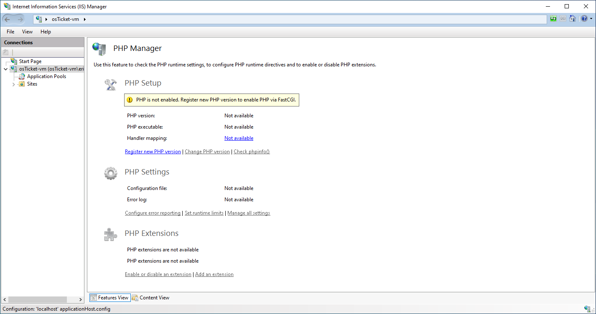 
      Before: PHP Not Registered
    </td>
    <td align="center">
      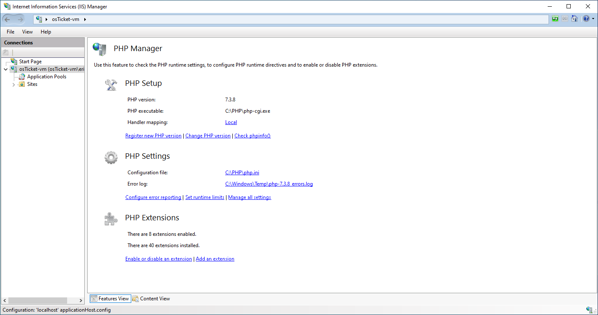 
      After: PHP Registered in IIS
    </td>
  </tr>
</table>

<h3>5. Installing MySQL</h3>

<ul>
  <li>Installed MySQL 5.5.62</li>
  <li>Used the standard configuration wizard</li>
  <li>Configured the MySQL root account</li>
</ul>

  MySQL provided the backend database required to store osTicket data, settings, and ticket records.

  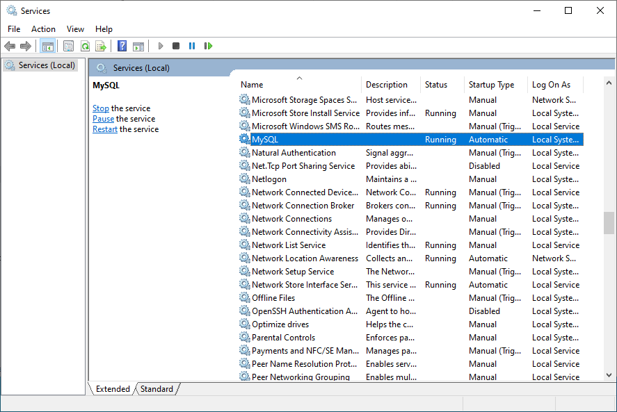

<h3>6. Deploying osTicket</h3>

<ul>
  <li>Extracted the osTicket installation files</li>
  <li>Copied the <code>upload</code> folder into <code>C:\inetpub\wwwroot</code></li>
  <li>Renamed <code>upload</code> to <code>osTicket</code></li>
  <li>Restarted IIS</li>
  <li>Opened the osTicket site in the browser through IIS</li>
</ul>

  This placed the application in the IIS web root and made it accessible through the local web server.

  

<h3>7. Resolving Missing PHP Extensions</h3>

<ul>
  <li>Opened the osTicket installer page and reviewed the prerequisite warnings</li>
  <li>Identified missing or disabled PHP modules</li>
  <li>Enabled the required extensions through PHP Manager:
    <ul>
      <li><code>php_imap.dll</code></li>
      <li><code>php_intl.dll</code></li>
      <li><code>php_opcache.dll</code></li>
    </ul>
  </li>
  <li>Restarted IIS and refreshed the installer page</li>
</ul>

  This demonstrated that successful application deployment depends not only on installing PHP, but also on enabling the correct runtime features required by the application.

<table align="center">
  <tr>
    <td align="center">
      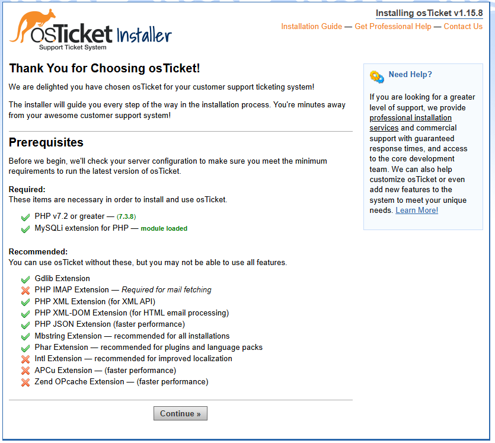 
      Before: Missing PHP Extensions
    </td>
    <td align="center">
       
      Fix: Required Extensions Enabled
    </td>
  </tr>
</table>

  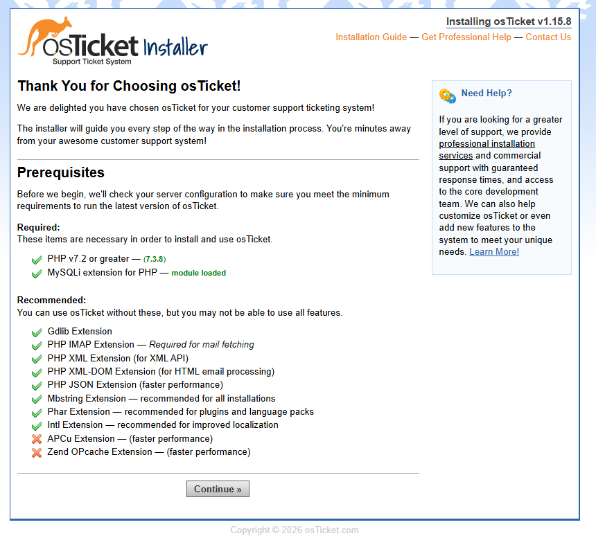

  Installer page showing the system ready to proceed.

<h3>8. Configuring osTicket Application Files</h3>

<ul>
  <li>Renamed <code>ost-sampleconfig.php</code> to <code>ost-config.php</code></li>
  <li>Disabled inheritance on the configuration file</li>
  <li>Adjusted permissions temporarily so setup could complete</li>
</ul>

  Proper configuration and file permissions were required before the browser-based installation could continue.

  

<h3>9. Creating the Database in HeidiSQL</h3>

<ul>
  <li>Installed HeidiSQL</li>
  <li>Connected to MySQL using the root account</li>
  <li>Created a new database named <code>osTicket</code></li>
</ul>

  This prepared the backend database required for the application installation.

  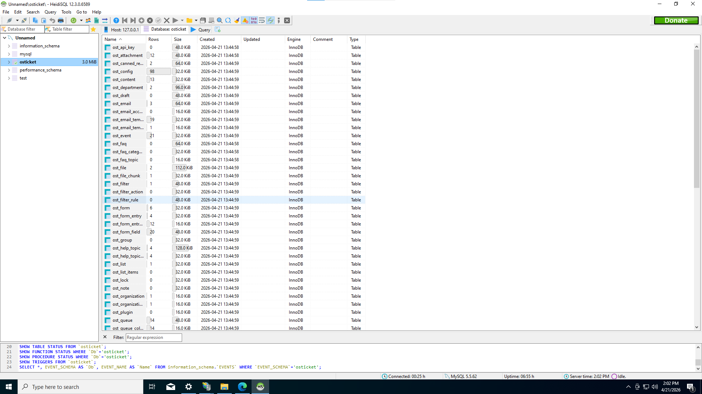

<h3>10. Completing osTicket Setup</h3>

<ul>
  <li>Entered the help desk name and default email address</li>
  <li>Entered the MySQL database information</li>
  <li>Completed the installation through the browser</li>
</ul>

  This confirmed that IIS, PHP, MySQL, and osTicket were working together as a complete application stack.

  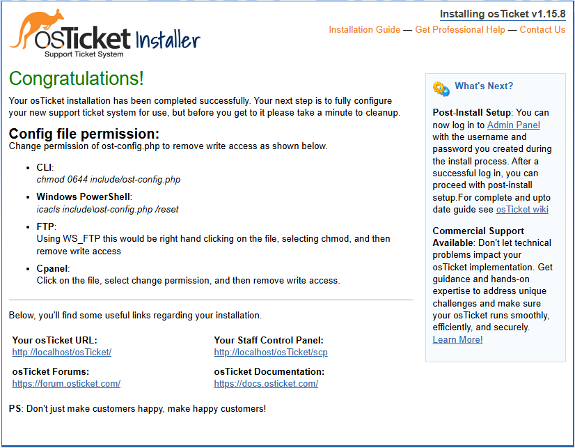

  

  Staff control panel showing successful login and active system functionality.

  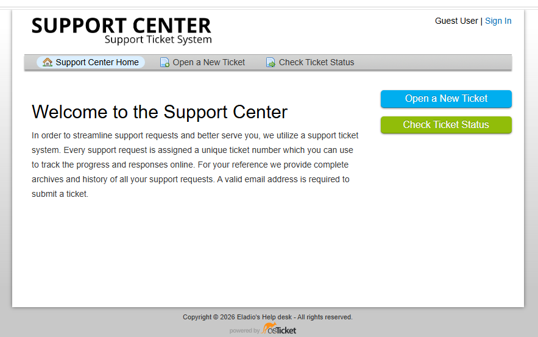

  End-user portal demonstrating the customer-facing support interface.

<h2>🔍 Troubleshooting</h2>

<h3>PHP Not Registered in IIS</h3>

<ul>
  <li><strong>Problem:</strong> PHP Manager showed that PHP was not enabled and no executable path was available</li>
  <li><strong>Cause:</strong> IIS had not yet been pointed to the PHP runtime</li>
  <li><strong>Fix:</strong> Registered <code>C:\PHP\php-cgi.exe</code> through PHP Manager and restarted IIS</li>
</ul>

  This reinforced that installing a runtime is not enough unless the web server is explicitly configured to use it.

<h3>Missing PHP Extensions</h3>

<ul>
  <li><strong>Problem:</strong> osTicket setup reported missing prerequisite extensions</li>
  <li><strong>Cause:</strong> PHP was installed, but required modules were not yet enabled</li>
  <li><strong>Fix:</strong> Enabled the required extensions in PHP Manager and refreshed the installer page</li>
</ul>

  This showed that application installation problems are often dependency problems rather than application problems.

<h3>Configuration File Access</h3>

<ul>
  <li><strong>Problem:</strong> osTicket required changes to the configuration file before installation could continue</li>
  <li><strong>Cause:</strong> Default file state and permissions were not suitable for setup</li>
  <li><strong>Fix:</strong> Renamed the sample configuration file and adjusted permissions temporarily</li>
</ul>

  This demonstrated how file permissions can directly affect application deployment.

<h2>🧠 Design Decisions</h2>

<ul>
  <li>Used Azure to simulate a realistic cloud-hosted support system environment</li>
  <li>Used IIS with CGI to support PHP-based application hosting on Windows</li>
  <li>Created a dedicated <code>C:\PHP</code> directory to keep the PHP runtime organized and separate</li>
  <li>Used HeidiSQL to simplify MySQL database creation and verification</li>
  <li>Validated both the staff and end-user interfaces to confirm the application was fully operational</li>
  <li>Performed post-installation cleanup to reduce unnecessary exposure of setup files</li>
</ul>

<h2>🛡️ Security Awareness</h2>

<ul>
  <li>Installation and setup files should not remain exposed after deployment</li>
  <li>Configuration file permissions should be tightened after installation completes</li>
  <li>Using readable passwords in documentation is not a real-world best practice</li>
  <li>Administrative credentials and database credentials should be protected using secure storage practices</li>
  <li>Post-installation cleanup is part of securing an application, not just finishing it</li>
</ul>

<h2>🌍 Real-World Relevance</h2>

<ul>
  <li>Help desk platforms are commonly used in IT environments to manage support requests and internal workflows</li>
  <li>Installing osTicket reinforces how web applications depend on the web server, runtime, database, and file permissions working together</li>
  <li>This type of deployment builds practical experience relevant to IT support, system administration, and entry-level infrastructure roles</li>
  <li>Validating both backend and frontend access reflects the type of end-to-end verification required in real environments</li>
</ul>

<h2>📌 Lessons Learned</h2>

<ul>
  <li>Web application deployment depends heavily on prerequisite components being installed in the correct order</li>
  <li>Missing runtime extensions can prevent an application from functioning even when the main software is already present</li>
  <li>File permissions are a critical part of both successful setup and post-installation hardening</li>
  <li>Installing an application is only part of the work; validation and cleanup matter too</li>
  <li>Understanding dependencies makes troubleshooting faster and more methodical</li>
</ul>

<h2>💭 Key Takeaways</h2>

  Before this lab, it would have been easy to think of installing a help desk platform as simply running an installer. In practice, the process required coordinating IIS, PHP, MySQL, application files, permissions, and browser-based configuration.

  This project helped me better understand how multiple infrastructure components support a single business application and how small missing pieces can prevent the entire system from working correctly.

<h2>🧹 Cleanup</h2>

<ul>
  <li>Deleted the <code>setup</code> folder from the osTicket web directory</li>
  <li>Changed <code>ost-config.php</code> permissions to read-only</li>
</ul>

  These steps reduced unnecessary exposure after installation and left the application in a more secure state.

  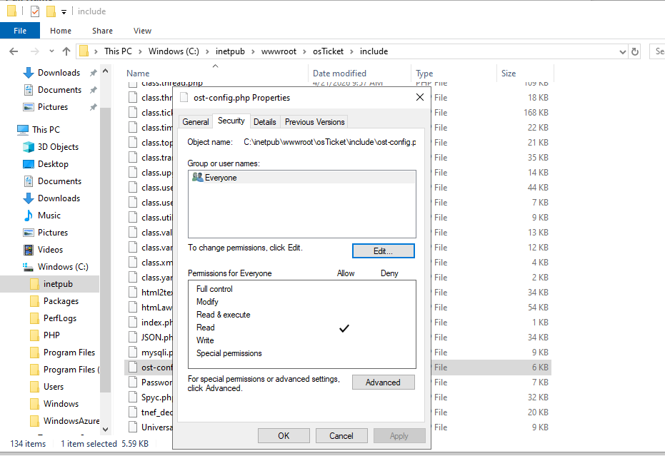

