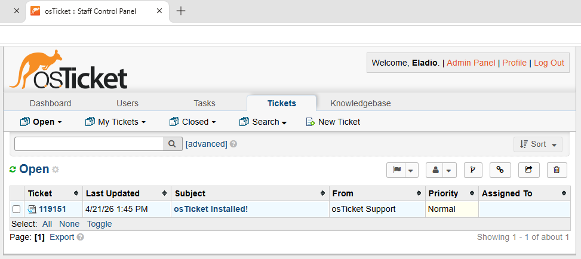
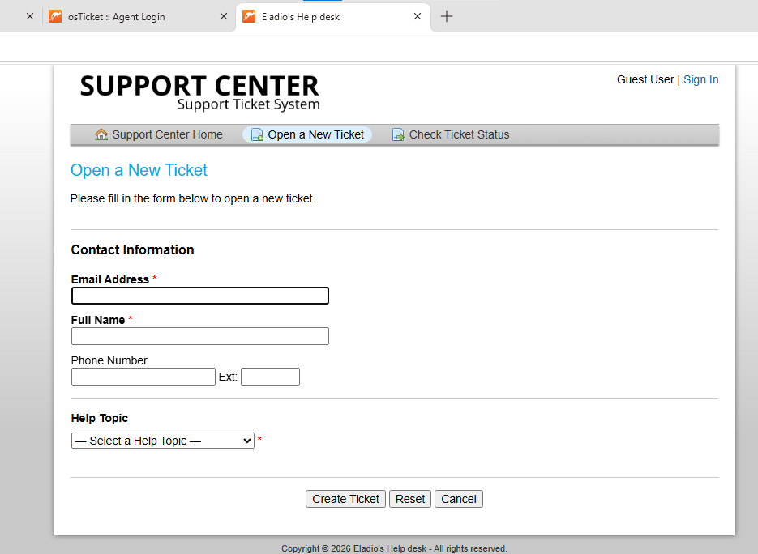

  

<h1 align="center">osTicket Deployment in Azure (Web Application Simulation)</h1>
This project demonstrates the deployment and configuration of a web-based ticketing system using osTicket on a Windows 10 virtual machine in Microsoft Azure, focusing on web server setup, dependency management, and backend integration.

---

## 🎯 Goals & Objectives

The goal of this project was to deploy a functional web application and understand how services like IIS, PHP, and MySQL work together to support it.

By the end of this lab, I aimed to:

- Deploy a Windows 10 virtual machine in Azure  
- Configure IIS with CGI support  
- Install and integrate PHP with IIS  
- Install and configure MySQL  
- Deploy osTicket into a web server environment  
- Resolve dependency and configuration issues  
- Validate a fully working ticketing system  

---

## 📌 Overview

In this project, I built a Windows-based environment in Azure to host osTicket. The focus was on understanding how web applications rely on multiple system layers and how misconfigurations at any layer can break the entire system.

---

## 🧰 Technologies Used

- Microsoft Azure (Virtual Machines)  
- Windows 10  
- Remote Desktop Protocol (RDP)  
- Internet Information Services (IIS)  
- PHP  
- MySQL  
- HeidiSQL  
- osTicket  

---

## 💻 Environment

- Windows 10 Virtual Machine (`osticket-vm`)  
- IIS with CGI enabled  
- PHP installed in `C:\PHP`  
- MySQL database  
- osTicket deployed in `C:\inetpub\wwwroot\osTicket`  

---

## ⚙️ Implementation

### 1. Infrastructure Setup
- Created a Windows 10 VM in Azure  
- Connected via Remote Desktop  
- Verified system accessibility  

  

---

### 2. PHP Configuration (Issue → Resolution)
- IIS initially unable to process PHP requests  
- Identified missing PHP registration  
- Configured FastCGI to integrate PHP with IIS  

<table align="center">
  <tr>
    <td align="center">
       
      PHP Not Registered
    </td>
    <td align="center">
       
      PHP Registered
    </td>
  </tr>
</table>

---

### 3. MySQL Setup & Database Verification
- Installed MySQL and verified service status  
- Created osTicket database using HeidiSQL  
- Confirmed tables were generated during installation  

  

  

---

### 4. osTicket Installation
- Deployed osTicket files into IIS web root  
- Completed installation through browser interface  
- Verified successful setup  

  

---

### 5. System Validation
- Accessed admin panel  
- Verified authentication  
- Created and tested ticket workflow  

  

  

---

## 🔍 Troubleshooting

### PHP Integration Issue
- Problem: IIS could not execute PHP files  
- Cause: PHP was not registered with FastCGI  
- Fix: Linked `php-cgi.exe` in IIS PHP Manager  

### Dependency Errors
- Problem: osTicket installer blocked due to missing PHP components  
- Cause: Required extensions not enabled  
- Fix: Enabled necessary PHP extensions  

### Database Configuration
- Problem: Application required backend database connectivity  
- Cause: No database configured initially  
- Fix: Installed MySQL and created database using HeidiSQL  

---

## 🧠 Design Decisions

- Used IIS instead of Apache to align with Windows-based environments  
- Installed PHP manually to better understand configuration process  
- Verified each dependency before proceeding to the next step  
- Used HeidiSQL for direct database visibility and validation  

---

## 🛡️ System Awareness

- Observed how multiple services (IIS, PHP, MySQL) must interact correctly  
- Noted that failure in one layer prevents application functionality  
- Reinforced importance of verifying services before troubleshooting  

---

## 🌍 Real-World Relevance

- Web applications depend on properly configured backend services  
- IIS + PHP is a common stack in Windows environments  
- Database integration is essential for dynamic applications  
- Troubleshooting multi-layer systems is a core IT skill  

---

## 📌 Lessons Learned

- Most failures occur due to misconfiguration, not installation  
- Dependency validation must happen before deployment  
- Each service should be tested independently  
- Small errors can prevent entire systems from functioning  

---

## 💭 Key Takeaways

Before this lab, I approached web applications as single systems. This project showed that they are dependent on multiple interconnected services.

Issues like PHP misconfiguration or missing dependencies required step-by-step troubleshooting rather than assumptions.

This experience reinforced the importance of isolating problems, validating each layer, and understanding how systems interact in a real-world environment.
